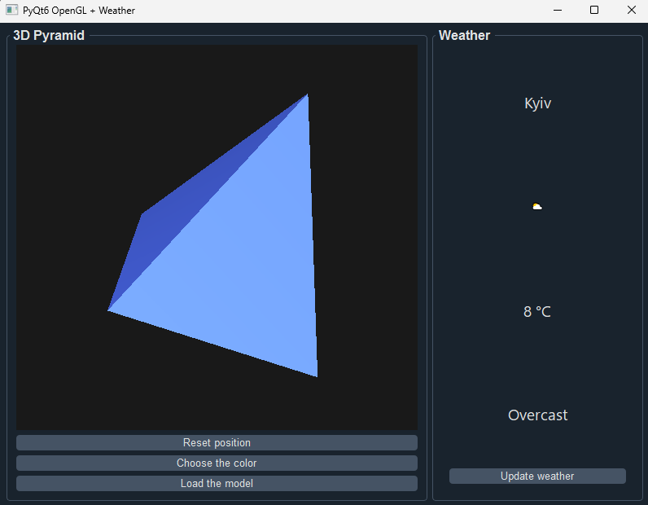
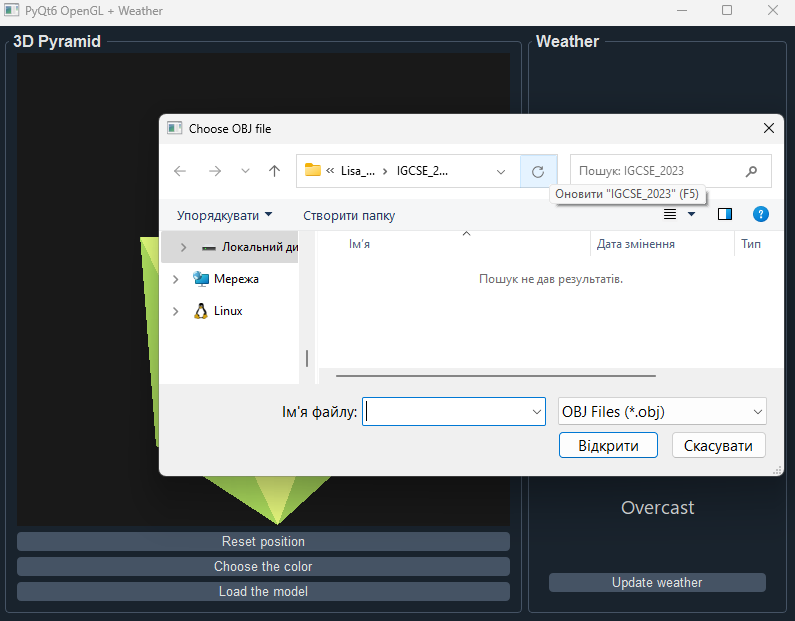

# PyQt6 OpenGL Weather App

A small desktop application in Python using PyQt6 and OpenGL to display a rotating 3D pyramid and a widget with the current weather.

## Functionality
- **3D pyramid**:
  - rotate with the mouse;
  - zoom with the wheel;
  - choose a color;
  - reset position;
  - upload of any model (.obj file).
- **Weather**:
  - receive and display data from wttr.in (Kyiv);
  - automatic update every 10 minutes;
  - update with button.

## Project structure
```text
weather_app/
├── README.md              # Project description
├── main.py                # Application entry point
├── ui/                    # UI components package
│   ├── init.py
│   ├── main_window.py     # Main window
│   └── weather_widget.py  # Weather widget
├── gl/                    # OpenGL components package
│   ├── init.py
│   └── pyramida_widget.py # 3D pyramid widget
├── services/              # Services package
│   ├── init.py
│   └── weather_service.py # Weather fetching logic and error handling
├── tests/                 # All tests for project
│   └── test_weather.py    # Tests for weather API
├── media/                 # Media files
│   ├── img.png
│   └── img1.png           # Screenshots for README.md
├── requirements.txt       # Dependencies
└── .gitignore             # Ignored files
```

## Installation
```bash
pip install -r requirements.txt
```

## Start project
```bash
python main.py
```

## Interface



